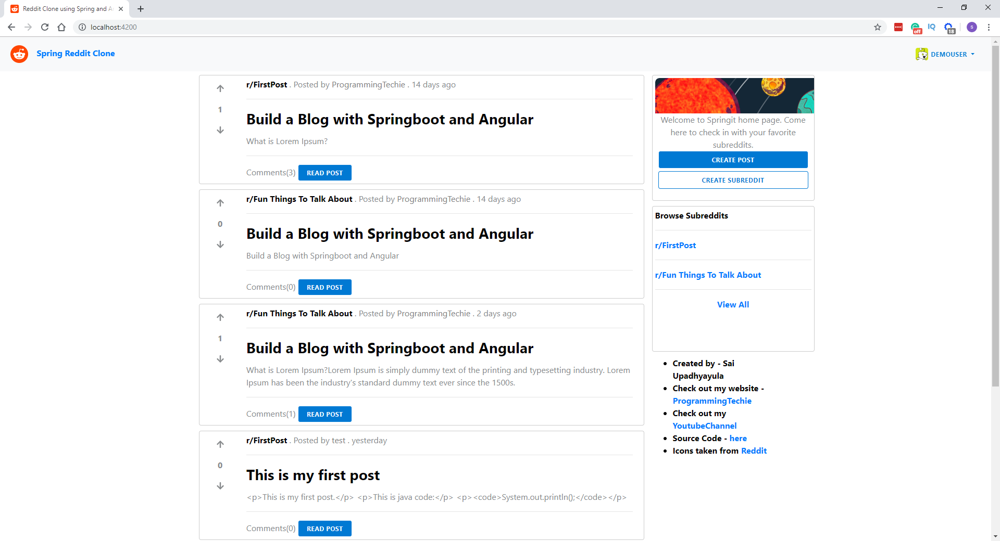
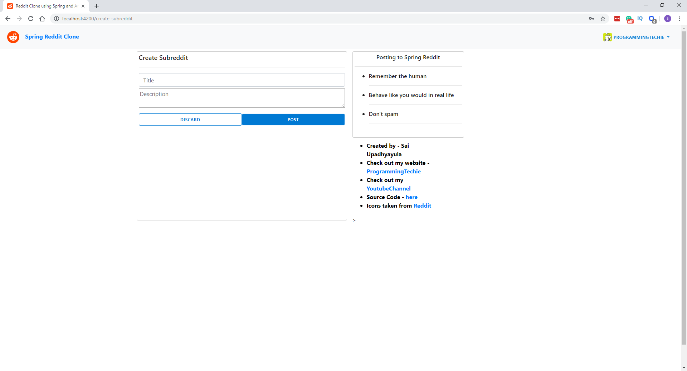

# Spring Reddit Clone
Reddit clone built using Spring Boot, Spring Security with JWT Authentication, Spring Data JPA with PostgreSQL.
The frontend is built using Angular - You can find the frontend source code here - https://github.com/ssotom/angular-reddit-clone

This application was developed based on the tutorials series of [Programming Techie](https://www.youtube.com/channel/UCD20RZV_WHQImisCW2QZwDw)

Please visit his web sites:
- [Youtube](https://www.youtube.com/channel/UCD20RZV_WHQImisCW2QZwDw)
- [Github](https://github.com/SaiUpadhyayula)
- [Blog](https://programmingtechie.com/)

## Demo
https://ssotom.github.io/angular-reddit-clone/

## API Documentation
https://ssotom-reddit-clone.herokuapp.com/swagger-ui.html

## Screenshots
1. Home Page

2. View Post Page

3. Create Post Page

4. Create Subreddit Page

5. User Profile Page

 